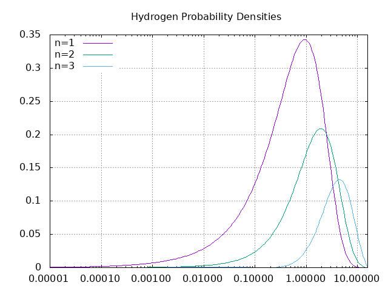

## Numerov Method for Shrodinger Equation with Radial Potential 

* path setup in go 
this folder quantum is under $GOPATH/src (this is a complosory location for go build tools) \
inside the folder quantum , type  go build  an executable quantum will be produced
* The grid is logarithimic, If the Eigen energies are correct, the wf is correct, but can't find them using a rootfinding algorithm. Instabilities it seems.

